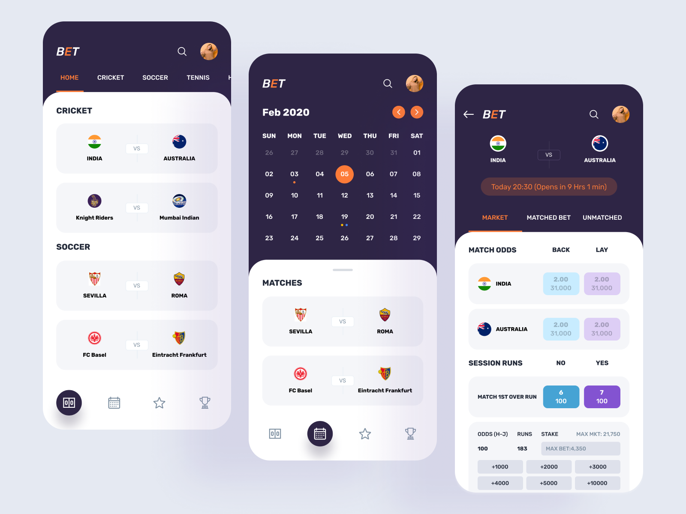
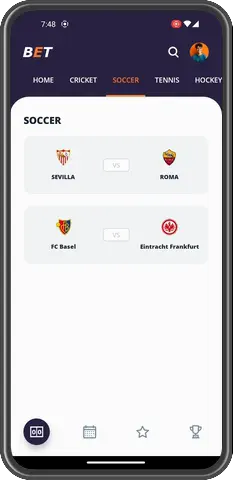
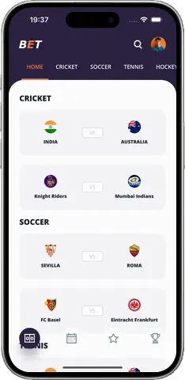

# Bet App

**.NET MAUI** implementation of [Bet App](https://dribbble.com/shots/14384464-Bet-App) design by [Manoj Rajput](https://dribbble.com/manojrajput).

This project demonstrates how to create **custom navigation experience and controls** using the [SimpleToolkit](https://github.com/RadekVyM/SimpleToolkit) library.

## Original design

## Installation

First, make sure you have your Visual Studio and .NET 8 environment set up for .NET MAUI development. If not, follow the [setup instructions](https://learn.microsoft.com/dotnet/maui/get-started/installation). Then make sure you have your [Android](https://learn.microsoft.com/dotnet/maui/get-started/first-app?pivots=devices-android) or [iOS](https://learn.microsoft.com/dotnet/maui/get-started/first-app?pivots=devices-ios) platform set up for deployment of the application.

Once everything is set up, you can clone the repo and run the application via Visual Studio or Visual Studio Code.

Here are some resources to learn more about .NET MAUI:

- [Official website](https://dotnet.microsoft.com/apps/maui)
- [Microsoft Learn](https://learn.microsoft.com/dotnet/maui/what-is-maui)
- [.NET MAUI GitHub repository](https://github.com/dotnet/maui)

## Features

Only .NET MAUI APIs, my [SimpleToolkit](https://github.com/RadekVyM/SimpleToolkit) library and the [Maui.BindableProperty.Generator](https://github.com/rrmanzano/maui-bindableproperty-generator) library were used to create this sample.

    
    &nbsp;&nbsp;
    

